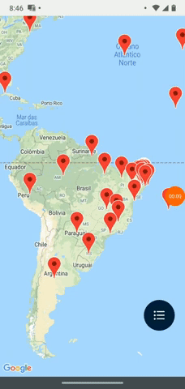
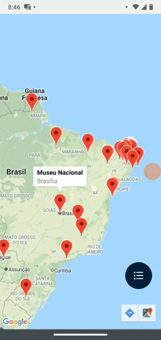
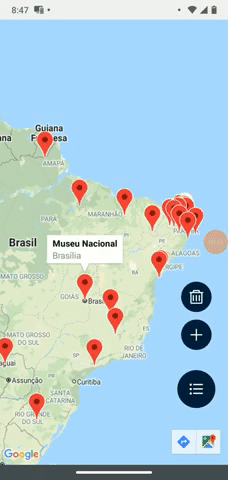

# AppMaps
## Aplicativo para salvar localizações com componente o MapView

O aplicativo possui duas telas, uma para exibir marcadores previamente cadastrados, e outra para cadastrar um novo marcador.

### TELA 1 – MAPA COM MARCADORES CADASTRADOS

Nesta tela o aplicativo acessa via chamada HTTPS GET a rota de API GET que retorna um array de objetos com 
informações necessárias para renderizar a tela exibida:

    

### TELA 2 – CADASTRO DE NOVOS MARCADORES
Essa tela é acessada a partir da TELA 1, mediante clique no botão para cadastrar um novo 
marcador. A Tela 2 contém um mapa, dois campos para entrada de texto e um botão para 
adicionar o novo marcador, conforme exibido:

    

Ao retornar para a tela 1 o novo marcador já está sendo exibido na tela através do hook useFocusEffect:

    

